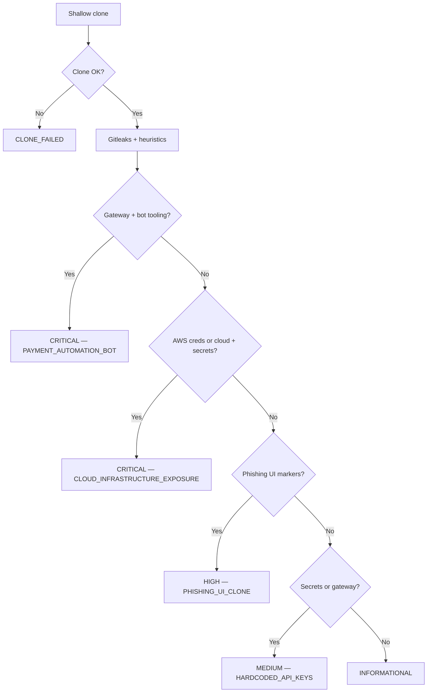

# Git_Finder

**Repository threat intelligence for AppSec.** Git_Finder shallow-clones a list of Git URLs, runs [Gitleaks](https://github.com/gitleaks/gitleaks) for hardcoded secrets, then applies contextual heuristics (payment gateways, phishing UI, cloud endpoints, browser automation) and writes a ranked CSV you can drop into an investigation queue.

Use it only on repositories you are authorized to assess (your org’s public leaks, bug-bounty in-scope assets, or explicitly approved third-party reviews).

## Why this exists

Public Git history is one of the fastest ways production credentials, merchant IDs, and cloned login flows leak. Git_Finder is a **batch triage** layer: it does not replace a full source review, but it scores volume so an AppSec engineer can spend time on `CRITICAL_THREAT` and `HIGH_THREAT` first.

## What you get

| Column | Meaning |
| --- | --- |
| `Repo_URL` | Target clone URL |
| `Verdict` | `CRITICAL_THREAT` · `HIGH_THREAT` · `MEDIUM_THREAT` · `INFORMATIONAL` · `CLONE_FAILED` |
| `Risk_Category` | Decision-engine label (payment bot, cloud exposure, phishing UI, keys, etc.) |
| `Technical_Context` | Short why |
| `Asset_Exposure` | Tagged classes (AWS, API keys, merchant ID, cloud storage) |
| `Identity` | Latest commit author email; `[CORP]` if it matches `--domain` |

## Decision matrix



Heuristics are **signals**, not proof. A Selenium helper in a test suite can look like a bot; a `login-container` class can be a legitimate SPA. Treat the CSV as a starting point, then confirm in the cloned source.

## Requirements

- Python 3.10+
- [Git](https://git-scm.com/)
- [Gitleaks](https://github.com/gitleaks/gitleaks) on `PATH` (optional but recommended)

No Python packages are required. The scanner is stdlib-only.

Install Gitleaks (examples):

```bash
# Windows (winget)
winget install Gitleaks.Gitleaks

# macOS
brew install gitleaks
```

If Gitleaks is missing, Git_Finder still runs heuristics and records `SCANNER_UNAVAILABLE` when no other signal fires.

## Quick start

```bash
git clone https://github.com/<you>/Git_Finder.git
cd Git_Finder
copy urls.example.txt urls.txt   # Windows
# cp urls.example.txt urls.txt  # macOS / Linux
```

Edit `urls.txt` — one HTTPS or SSH Git URL per line. Then:

```bash
python git_finder.py
```

Report: `intelligence_audit.csv`

### CLI

```bash
python git_finder.py -i urls.txt -o intelligence_audit.csv -w 5 -d example.com
```

| Flag | Default | Purpose |
| --- | --- | --- |
| `-i` / `--input` | `urls.txt` | Target list |
| `-o` / `--output` | `intelligence_audit.csv` | CSV path |
| `-w` / `--workers` | `5` | Parallel clones |
| `-d` / `--domain` | `example.com` | Corporate email suffix for `[CORP]` tagging |

## How a scan works

1. **Shallow clone** (`git clone --depth 1`) with `GIT_TERMINAL_PROMPT=0` so private/auth walls fail closed instead of hanging.
2. **Author** from `git log -1 --format=%ae`.
3. **Gitleaks** `detect --no-git` on the working tree; rule IDs are rolled up to `AWS_Credentials`, `API_Keys`, or `Generic_Secrets`.
4. **Heuristic regex** over common source/config extensions (not binary blobs, not `node_modules`).
5. **Cleanup** — clone directories are deleted after each repo.

Temporary clones live as `intel_<nanoseconds>/` next to the script. Interrupted runs may leave leftovers; they are gitignored.

## Responsible use

- Authorized targets only. Cloning and secret-scanning repos you do not have permission to assess can violate law and policy.
- Findings often include live credentials. Store `intelligence_audit.csv` and `urls.txt` outside git (already gitignored). Rotate anything confirmed real.
- Do not use this to weaponize payment bots, phishing kits, or stolen cloud keys. The classifications exist so you can **take them down and remediate**.

## Project layout

```
Git_Finder/
├── git_finder.py       # scanner
├── urls.example.txt    # sample input
├── LICENSE             # MIT
└── README.md
```

## License

MIT. See [LICENSE](LICENSE).
